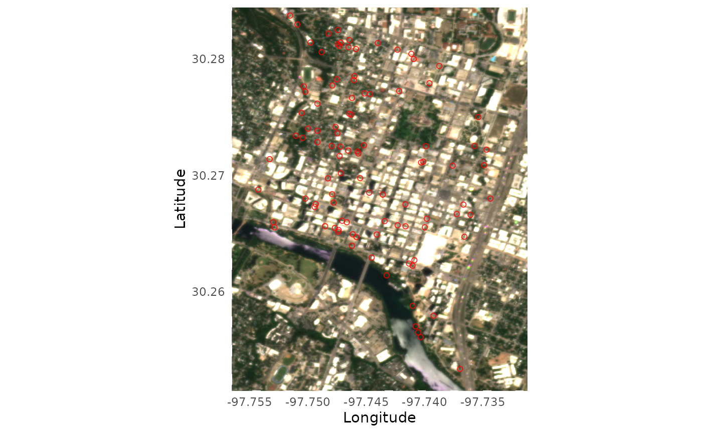

# 2 Customization and advanced usage

``` r
library(BatchPlanet)
```

We understand that you may want to have more control over your workflow.
Here are some examples of how you can use the functions in the package
to customize your workflow.

## Direct search and order for a single site

Similar to the batch downloading process, you first need to set the
parameters for your PlanetScope imagery search and order using the
[`set_planetscope_parameters()`](https://zhulabgroup.github.io/BatchPlanet/reference/set_planetscope_parameters.md)
function.

``` r
setting <- set_planetscope_parameters(
  api_key = set_api_key(),
  item_name = "PSScene",
  asset = "ortho_analytic_4b_sr",
  product_bundle = "analytic_sr_udm2",
  cloud_lim = 1,
  harmonized = T
)
```

If you would like to customize your batch downloading process, you may
use the functions
[`search_planetscope_imagery()`](https://zhulabgroup.github.io/BatchPlanet/reference/search_planetscope_imagery.md)
and
[`order_planetscope_imagery()`](https://zhulabgroup.github.io/BatchPlanet/reference/order_planetscope_imagery.md)
to search and order images for a single site and time period. Be careful
not to order too many images at once, as the Planet API has an internal
limit. The
[`order_planetscope_imagery_batch()`](https://zhulabgroup.github.io/BatchPlanet/reference/order_planetscope_imagery_batch.md)
function is designed to handle multiple sites and years in a more
streamlined manner.

``` r
df_coordinates_NEON <- readr::read_csv(system.file("extdata", "NEON", "example_neon_coordinates.csv", package = "BatchPlanet"), show_col_types = FALSE)

# Set the bounding box for the site of interest
bbox <- set_bbox(df_coordinates_NEON, "SJER")

images <- search_planetscope_imagery(
  api_key = setting$api_key,
  bbox = bbox,
  date_end = "2025-03-31",
  date_start = "2025-03-01",
  item_name = setting$item_name,
  asset = setting$asset,
  cloud_lim = setting$cloud_lim
)
order_id <- order_planetscope_imagery(
  api_key = setting$api_key,
  bbox = bbox,
  items = images,
  item_name = setting$item_name,
  product_bundle = setting$product_bundle,
  harmonized = setting$harmonized,
  order_name = "SJER_2025_60_90"
)
```

## Direct download from a single order

If you would like to customize your batch downloading process, you may
use the function
[`download_planetscope_imagery()`](https://zhulabgroup.github.io/BatchPlanet/reference/download_planetscope_imagery.md)
to download images from a single order. You can find the order ID saved
in the `raw/` folder, or you can find it in the past orders in your
Planet account, if you did not use
[`order_planetscope_imagery_batch()`](https://zhulabgroup.github.io/BatchPlanet/reference/order_planetscope_imagery_batch.md)
to order images.

``` r
download_planetscope_imagery(
  order_id = "dummy",
  exportfolder = "dummy",
  api_key = setting$api_key,
  overwrite = F
)
```

## Visualize a single true color image

You can visualize the true color imagery of single images using the
[`visualize_true_color_imagery()`](https://zhulabgroup.github.io/BatchPlanet/reference/visualize_true_color_imagery.md)
function. You can overlay the coordinates from the relevant site on the
imagery (optional). You can specify the brightness of the image using
the `brightness` parameter.

``` r
df_coordinates_urban <- readr::read_csv(system.file("extdata", "urban", "example_urban_coordinates.csv", package = "BatchPlanet"), show_col_types = FALSE)

set.seed(42)
df_coordinates_AT <- df_coordinates_urban |>
  dplyr::filter(site == "AT") |>
  dplyr::sample_n(100)

visualize_true_color_imagery(
  file = system.file("extdata", "urban", "raw", "AT", "AT_2025_121_151", "20250521_174012_92_252e_3B_AnalyticMS_SR_harmonized_clip.tif", package = "BatchPlanet"),
  df_coordinates = df_coordinates_AT,
  brightness = 4
)
```



## Direct retrieval of time series for a set of coordinates

For demonstration purpose, we are going to set the data directory to a
subfolder of the `sample-data` folder. You should set your own directory
when you carry out your analysis.

``` r
download_sample_data()
```

    ## Sample data successfully downloaded to /home/runner/work/BatchPlanet/BatchPlanet/vignettes/sample-data

``` r
dir_data <- "sample-data"
dir_data_NEON <- file.path(dir_data, "NEON")
```

If you would like to customize your time series retrieval process, you
may use the function
[`retrieve_planetscope_time_series()`](https://zhulabgroup.github.io/BatchPlanet/reference/retrieve_planetscope_time_series.md)
for a single folder `dir_site` and a set of coordinates you specify.

``` r
df_coordinates_example <- df_coordinates_NEON |> dplyr::filter(site == "SJER", group == "Quercus")
df_ts_example <- retrieve_planetscope_time_series(
  dir_site = file.path(dir_data_NEON, "raw", "SJER"),
  sf_coordinates = df_coordinates_example |> sf::st_as_sf(coords = c("lon", "lat"), crs = sf::st_crs(4326)),
  num_cores = 10
)
```

## Clean time series data in a single data frame

To process a single set of time series in a data frame, you can use the
[`clean_planetscope_time_series()`](https://zhulabgroup.github.io/BatchPlanet/reference/clean_planetscope_time_series.md)
function.

``` r
df_ts_example <- read_data_product(dir = dir_data_NEON, v_site = "SJER", v_group = "Quercus", product_type = "ts")
df_clean_example <- clean_planetscope_time_series(df_ts = df_ts_example, calculate_index = "evi", filter_range = list(evi = c(0, 1)))
```

## Calculate start/end of season metrics from a single data frame

You can customize your own start/end of season metrics calculation, not
necessarily PlanetScope data or even EVI data, using the
[`calculate_season_metrics()`](https://zhulabgroup.github.io/BatchPlanet/reference/calculate_season_metrics.md)
function that takes a data frame of time series data and a data frame of
thresholds and returns a data frame with the calculated start/end of
season metrics.

``` r
df_clean_example <- read_data_product(dir = dir_data_NEON, v_site = "SJER", v_group = "Quercus", product_type = "clean")
df_thres <- set_thresholds(thres_up = c(0.3, 0.4, 0.5), thres_down = NULL)
df_doy_example <- calculate_season_metrics(df_index = df_clean_example, df_thres = df_thres, var_index = "evi", min_days = 20, check_seasonality = F)
```
